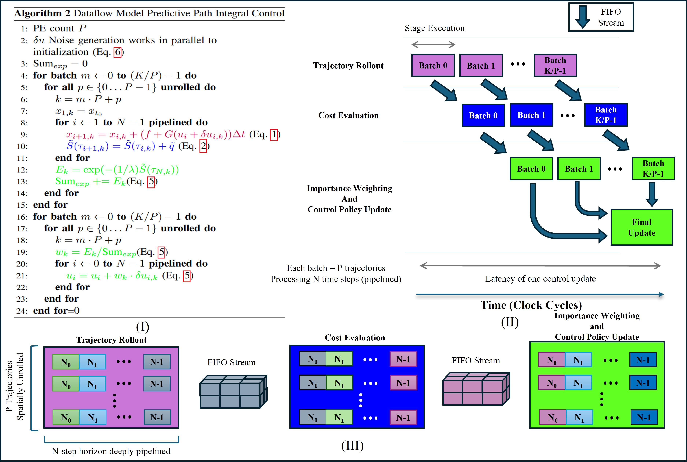
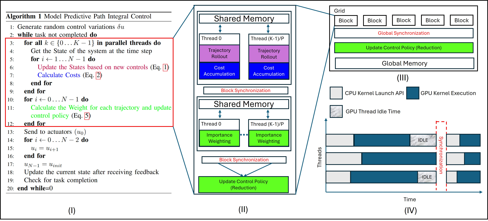

# MPPI FPGA Dataflow

**Model Predictive Path Integral (MPPI) Control on FPGA using Vitis HLS**

This project implements a high-performance Model Predictive Path Integral (MPPI) controller on Xilinx FPGA using Vitis HLS and a dataflow architecture. The design achieves real-time control with low latency through extensive pipelining and parallel processing of trajectory rollouts.

## Overview

MPPI is a sampling-based optimal control algorithm that:
1. Generates random control variations
2. Simulates trajectories in parallel
3. Evaluates costs for each trajectory
4. Computes importance weights
5. Updates the control policy

The FPGA dataflow implementation processes multiple parallel trajectories with pipelined stages for trajectory rollout, cost evaluation, and importance weighting.

### Dataflow Architecture



The dataflow model consists of three main stages:
- **Trajectory Rollout (Purple)**: N-step horizon dynamics simulation, deeply pipelined
- **Cost Evaluation (Blue)**: Cost accumulation for each trajectory
- **Importance Weighting (Green)**: Weight computation and control policy update

Each stage operates on batches of P trajectories, with K/P batches processed per control update, allowing continuous FIFO streaming between stages.

### GPU Architecture and Its Limitations



While GPUs enable parallel trajectory execution, they suffer from fundamental architectural bottlenecks when applied to MPPI:

**Sequential Prediction Within Threads**: Even when each trajectory executes in parallel across GPU threads, the prediction loop runs sequentially within each thread. This sequential dependence on the horizon length N becomes the dominant latency factor.

**Hardware Hierarchy Bottleneck**: The GPU's hardware hierarchy severely penalizes MPPI's synchronization requirements. All K trajectories cannot be consolidated into a single thread block due to hard resource limits (register files and shared memory per Streaming Multiprocessor). Consequently, the workload must be partitioned across a grid of multiple blocks, necessitating **global synchronization barriers** that force the algorithm to rely on high-latency, off-chip global memory transactions instead of fast on-chip shared memory used within individual blocks. Repeated synchronizations and irregular memory access patterns severely limit hardware utilization.

**Scalability Saturation**: While GPUs theoretically support scaling K to tens of thousands of threads, MPPI performance effectively saturates at relatively low sample counts (~10³ trajectories). This is due to the fundamental O(1/√N) convergence rate of the underlying Monte Carlo estimators in Information Theoretic MPC. Over-provisioning the GPU with excessive thread blocks merely exacerbates global synchronization latency and wastes power without meaningful improvement in control authority.

**Why FPGA Dataflow is Superior**: The FPGA dataflow architecture elegantly sidesteps these limitations through:
- **Pipeline Parallelism**: Stages operate continuously without global synchronization barriers
- **Fine-grained Streaming**: Trajectories flow through stages via FIFO channels, eliminating off-chip memory bottlenecks
- **Customizable Resource Allocation**: Unroll factors and array partitioning can be tuned to hardware capabilities
- **Deterministic Latency**: No thread scheduling overhead or memory coherency stalls


## Getting Started with Vitis HLS

### Prerequisites

- **Vitis 2023.1** or later (or compatible version)
- **Vivado Design Suite** (included with Vitis)
- Xilinx license for HLS compilation
- Linux or Windows with bash shell

### Installation

1. **Install Vitis HLS**
   - Download from [Xilinx Downloads](https://www.xilinx.com/support/download.html)
   - Set up the environment:
     ```bash
     source /path/to/Vitis/2023.1/settings64.sh
     ```

### Project Structure

```
MPPI_FPGA_DATAFLOW/
├── MPPI_FLOAT/                    # HLS Project
│   ├── MPPI_Float/                # Source files 
│   │   ├── mppi_control.cpp      # Main MPPI algorithm
│   │   ├── dynamics.cpp          # System dynamics model
│   │   ├── costs.cpp             # Cost evaluation
│   │   ├── compute_weight.cpp    # Importance weighting
│   │   ├── gaussian_noise_gen.cpp # Random number generation
│   │   ├── datatypes.hpp         # Data type definitions
│   │   ├── globals.hpp/.cpp      # Global parameters
│   │   ├── hls_config.cfg        # HLS configuration
│   │   └── tb.cpp                # Testbench
│   └── _ide/                      # Vitis IDE files
├── Vivado_ws/                     # Vivado projects (pre-built designs)
└── README.md                      # This file
```

## Building the Project

### Step 1: Open Vitis HLS

```bash
cd MPPI_FLOAT/MPPI_Float
vitis_hls
```

### Step 2: Create/Open Project

**Option A: Create New Project**
1. File → New HLS Project
2. Project name: `mppi_control`
3. Add source files:
   - `mppi_control.cpp`
   - `dynamics.cpp`
   - `costs.cpp`
   - `compute_weight.cpp`
   - `gaussian_noise_gen.cpp`
   - `helper.cpp`
   - `smoothning_filter.cpp`
   - `nearest_neighbor.cpp`
   - `clip.cpp`
   - `ref_path.cpp`

4. Add header files:
   - `datatypes.hpp`
   - `globals.hpp`
   - `ref_path.hpp`

5. Set testbench: `tb.cpp`
6. Set top function: `calc_control_input`

**Option B: Import Configuration**
- Use the provided `hls_config.cfg` file to load all settings automatically

### Step 3: Configure HLS Settings

In **Project → Project Settings**:

- **Part**: `xczu9eg-ffvb1156-2-e` (Ultra96-V2 FPGA)
- **Flow Target**: Vivado
- **Clock Period**: 5 ns (200 MHz)
- **Dataflow Default Channel**: FIFO

Key directives:
```cpp
#pragma HLS dataflow
#pragma HLS pipeline II=1
#pragma HLS array_partition
```

### Step 4: Run C Simulation

```bash
Solution → Run C Simulation
```

This verifies functional correctness before synthesis.

### Step 5: Synthesize

```bash
Solution → Run HLS Synthesis
```

Output: RTL Verilog/VHDL and IP catalog

### Step 6: Generate IP

```bash
Solution → Export RTL
```

Creates an IP package for integration into Vivado projects (in `Vivado_ws/`).

## Key Parameters

Edit `globals.hpp` to configure:

```cpp
#define K = 256              // Number of trajectories
#define N = 64               // Horizon length
#define CONTROL_SIZE = 2    // Input dimensionality
#define STATE_SIZE = 4      // State dimensionality
```

## File Descriptions

| File | Purpose |
|------|---------|
| `mppi_control.cpp` | Main MPPI control loop with batching |
| `dynamics.cpp` | System model predictions |
| `costs.cpp` | Cost function evaluation |
| `compute_weight.cpp` | Importance weighting (exponential, softmax) |
| `gaussian_noise_gen.cpp` | Random trajectory perturbations |
| `datatypes.hpp` | Float/fixed-point type definitions |
| `tb.cpp` | C++ testbench for simulation |


## Debugging Tips

1. **C Simulation Failing**
   - Check `tb.cpp` input values
   - Verify dynamic range in `datatypes.hpp`

2. **Synthesis Errors**
   - Review HLS pragmas (directives)
   - Check for non-synthesizable C++ constructs
   - Monitor array sizes and loops

3. **High Resource Usage**
   - Reduce K (trajectory count)
   - Reduce N (horizon length)
   - Adjust `#pragma HLS array_partition`

## Integration with Vivado

Pre-built Vivado projects are available in `Vivado_ws/`:
- `calc_control_input.xpr` - Main project
- Multiple `.xsa` files for different configurations

To use:
1. Open project in Vivado
2. Open Block Design
3. Import updated MPPI IP from HLS export
4. Generate bitstream
5. Package for deployment

## References

- [Vitis HLS User Guide](https://docs.xilinx.com/r/en-US/ug1399-vitis-hls)
- [Vivado Design Suite User Guide](https://docs.xilinx.com/r/en-US/ug910-vivado-getting-started)
- [MPPI Control Algorithm](https://en.wikipedia.org/wiki/Path_integral_control)

## License

See [LICENSE](LICENSE) file for details.

## Contributing

For questions or contributions, please refer to the project documentation or contact the development team.
